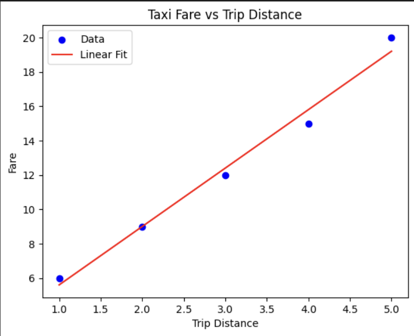
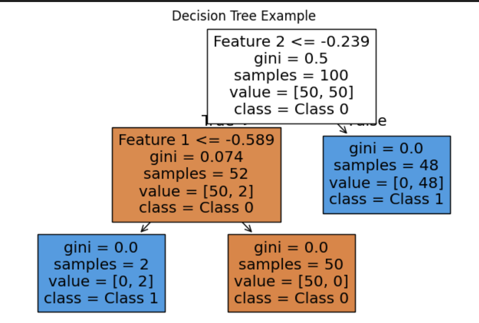

HW 4 - Comparing Machine Learning Approaches: Linear Models, Decision Trees, and SVMs

Machine learning has been the focal point in my AIT-736 class, and I’ve been learning about different models that can be used in various settings like when they might work the best and when I should be careful with using certain models. Three main methods I learned are linear models, decision trees and support vector machines (SVMs). Each one has its own way of making predictions and through these exercises, I’ve gotten to see where they work well and where they don’t.

Starting with linear models, these are probably the most straightforward to understand and utilize right off the bat. They assume a straight-line relationship between the features and the output. It tries to fit the best line through the data to predict the outcomes, while logistic regression is used for classification. What I like about linear model is how interpretable it is. You can look at the coefficients and understand how each feature contributes to the prediction. They are also very fast to train which makes them practical when you just need a simple answer. On the other hand, it isn't the best when the data has nonlinear relationships. In class, we worked on a taxi dataset where the goal was to predict fares from trip distances. The linear model captured the basic trend, but it didn’t really handle things like traffic delays or unusual routes. This showed  that while the model was simple and easy to explain, it missed some of the complexity in the real-world data.

Here is an example of the linear regression model.

from sklearn.linear_model import LinearRegression
import matplotlib.pyplot as plt
import numpy as np

X = np.array([[1], [2], [3], [4], [5]])
y = np.array([6, 9, 12, 15, 20])  # pretend taxi fares

model = LinearRegression().fit(X, y)

plt.scatter(X, y, color="blue", label="Data")
plt.plot(X, model.predict(X), color="red", label="Linear Fit")
plt.title("Taxi Fare vs Trip Distance")
plt.xlabel("Trip Distance")
plt.ylabel("Fare")
plt.legend()
plt.savefig("linear_regression_taxi.png")
plt.show()

Decision trees on the other hand work in a very different way. Instead of fitting a line, they split the data based on questions like “Is Hansol really taller than 6ft?” Each split makes the tree more specific until you end up at a prediction. I liked trees because they are intuitive. You can actually trace the path and explain why the model made such a decision. But the main problem I saw is that they can easily overfit, especially when the tree is too deep. Small changes in the data can also change the whole structure of the tree. In one of our exercises with Random Forests, I saw how combining many trees helped with this problem. A single decision tree might memorize the data too much, but a random forest balances it out by averaging the predictions from many trees. That made the results more stable and accurate, which really highlighted why this is often preferred over a single tree.

Here is an example of Decision Trees.

from sklearn.datasets import make_classification
from sklearn.tree import DecisionTreeClassifier, plot_tree
from sklearn.ensemble import RandomForestClassifier
import matplotlib.pyplot as plt

X, y = make_classification(n_features=2, n_redundant=0, n_classes=2, 
                           n_clusters_per_class=1, n_samples=100, random_state=42)
dt = DecisionTreeClassifier(max_depth=3, random_state=42).fit(X, y)
rf = RandomForestClassifier(n_estimators=50, random_state=42).fit(X, y)

print("Decision Tree Accuracy:", dt.score(X, y))
print("Random Forest Accuracy:", rf.score(X, y))

plt.figure(figsize=(8,5))
plot_tree(dt, filled=True, feature_names=["Feature 1", "Feature 2"], class_names=["Class 0", "Class 1"])
plt.title("Decision Tree Example")
plt.savefig("decision_tree.png")
plt.show()

SVMs were probably the trickiest for me to wrap my head around at first. The main idea is that they try to separate classes by finding the best boundary that maximizes the margin between the closest points. What makes SVMs powerful is the “kernel trick,” which allows the algorithm to separate data that isn’t linearly separable by transforming it into higher dimensions.

In class, I tested both linear and RBF kernels on a tabular dataset. The linear kernel worked okay, but the RBF kernel was able to capture more complex boundaries, which improved accuracy. The drawback I noticed is that SVMs take longer to train and are harder to interpret compared to decision trees or linear models.

Another thing that stood out during class discussions is how SVMs can be really slow and computationally expensive, especially on larger datasets. This makes them less practical in some real-world applications where speed and scalability matter. We also briefly talked about how newer approaches like deep learning are becoming more common in tasks such as face recognition, where neural networks can outperform SVMs by handling massive amounts of data more efficiently. I’m pretty excited to see how these methods compare in practice, and it made me realize that while SVMs are still important to learn, there’s a clear trend toward deep learning in modern AI applications.

Comparing the three methods side by side, I noticed each has its strengths and weaknesses. Linear models are simple and fast but can be too limited when the data isn’t linear. Decision trees are easy to explain and flexible, but they overfit easily. SVMs works very well especially when the data is high-dimensional or nonlinear, but it can be slow to run and harder to explain. In practice, I think the choice depends a lot on the situation. If I needed a quick answer, I’d start with a linear model. If I needed clear rules like in financial institutions, a decision tree maybe would make more sense. If the data was complex and accuracy mattered most like scientific research, then I’d probably lean toward SVMs.

Overall, working with these three models gave me a good understanding of the tradeoffs in machine learning. I realized there isn’t a one fits all model for everything. It really depends on the underlying problem, the data, and what’s most important to solve. Seeing them actually applied to datasets like the taxi regression and the Random Forest vs. SVM comparisons helped me understand the strengths and limits of each method.

## Comparison Table

| Aspect            | Linear Models                          | Decision Trees                          | Support Vector Machines (SVMs)               |
|-------------------|----------------------------------------|-----------------------------------------|----------------------------------------------|
| **Main idea**     | Fit a straight line or plane           | Split data into if–then rules            | Find the best boundary by maximizing margin  |
| **Assumptions**   | Linear relationships, independent errors | Few assumptions about the data           | Data can be separated with a margin          |
| **Strengths**     | Simple, fast, interpretable            | Easy to explain, handles mixed data       | Handles complex/nonlinear data, powerful in high dimensions |
| **Weaknesses**    | Poor with nonlinear data, sensitive to outliers | Prone to overfitting, unstable            | Computationally heavy, hard to tune, less interpretable |
| **Use cases**     | Forecasting, regression, quick baselines | Medical/finance decisions, customer segmentation | Text classification, image recognition, bioinformatics |
| **Class takeaway**| Taxi fares: line shows the trend but misses complexity | Random forest helps trees be more stable | RBF kernel captures curvy boundaries but harder to explain |

